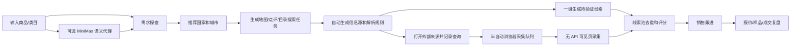

# B2B Lead Generation Plan

This document records the product pivot from cross-border marketplace operations toward B2B merchant lead discovery and sales follow-up.

## Product Goal

Given a product or category, identify countries where demand is likely to exist, then find relevant stores, distributors, wholesalers, or local service businesses in those countries and prepare contactable leads for sales follow-up.

Example:

1. Input: `钓鱼竿`.
2. Demand exploration suggests Thailand, Philippines, Indonesia, Malaysia, and the United States.
3. The system generates search tasks for fishing tackle shops, outdoor stores, marine supply stores, and sporting goods retailers.
4. The system generates source plans for maps, review platforms, directories, and search engines.
5. In the MVP, operators can also use one-click generation: enter a product intent and receive target store leads with source URLs and validation status.
6. Production enrichment should use Google Places API, official POI APIs, or explicit browser-assisted extraction to fill real phone, website, rating, and address evidence.
7. When API access is unavailable, operators can use a no-API browser-visible capture bookmarklet to bring the currently visible search/map/directory page text back into the local parser.
8. The semi-automatic MVP queue can now select a source plan, copy a plan-bound capture bookmarklet, open the external source URL, and route returned visible text to the correct lead preview.
9. Product intent understanding can optionally use MiniMax through a local server-side proxy; if no key is configured, the frontend falls back to local deterministic rules.

## Core Workflow



## Demand Exploration

The demand exploration module should combine multiple signals. In the local MVP, these are modeled as configurable assumptions; future versions can attach real evidence.

| Signal | Meaning | MVP source | Future source |
| --- | --- | --- | --- |
| Search interest | Whether buyers search for this product/category | Local rules and operator notes | Google Trends, search engine result counts, SEO tools |
| Retail density | Whether local stores exist for this category | Generated map/search tasks | Maps/POI APIs, visible page capture, industry directories |
| Use-case fit | Whether the product fits climate, hobby, lifestyle, or business scenarios | Local category rules | Country/category research, social content, marketplace category data |
| Import fit | Whether the country is plausible for imported wholesale goods | Operator assumption | Customs/import data, trade databases, freight data |
| Contactability | Whether stores expose phone, website, email, WhatsApp, Line, or social pages | Manual or visible-page review | Browser-assisted extraction and verification |

## One-Click MVP Behavior

The local MVP now treats the product input as the main operating entry point:

1. Infer the product type and target customer types.
2. Recommend countries, cities, and search terms.
3. Generate source plans for maps, review platforms, search, and directories.
4. Record query runs for the generated source URLs.
5. Create `待验证` store leads with source URLs and confidence `C`.

These one-click leads are useful for workflow testing and sales list structuring, but they are not a substitute for real POI enrichment. Real contact fields should come from Google Places API, official local POI APIs, approved data providers, or explicit browser-assisted visible-page extraction.

## Optional MiniMax Understanding

MiniMax is connected only through the local dev server:

1. The frontend sends product intent, target region, and optional countries to `/api/ai/understand-demand`.
2. The local server reads `MINIMAX_API_KEY` from `.env.local` or the process environment.
3. The server calls MiniMax and asks for strict JSON with product type, customer types, search terms, target countries/cities, demand signals, and reasoning.
4. The server normalizes that JSON and returns it to the frontend.
5. If the key is missing or the API call fails, the frontend uses local rule-based inference.

The MiniMax key must never be placed in frontend code, localStorage, sample data, docs, screenshots, or Git history. Commit only `.env.example` with empty placeholders.

## No-API Browser Capture

When official map or POI APIs are not available, the MVP supports a browser-visible capture handoff:

1. Select or prepare a generated source plan.
2. Open its Google/Bing/map/directory search URL.
3. Click the local capture bookmarklet on that external page.
4. The bookmarklet reads only `document.body.innerText` from the current visible page, trims it, and returns to the local app through a URL hash payload.
5. The local parser turns that visible text into a preview, then the operator confirms valid leads into the lead pool.

This mode does not run a background crawler, does not store cookies, and does not bypass login, CAPTCHA, or hidden data. It is less stable than an API because search/map page layouts and visible text quality vary by platform.

## Semi-Automatic Browser Queue

The local MVP now adds a queue layer on top of no-API capture:

1. The operator enters a product intent such as `鱼竿`.
2. The system creates demand research, target countries/cities, customer types, and source plans.
3. The operator clicks `采集下一条` or `开始采集` on a source plan.
4. The system selects that source plan, records a capture run, copies a bookmarklet containing the plan id, and opens the external source URL.
5. The operator clicks the bookmarklet on the external page.
6. The local app receives the visible text, matches it back to the original source plan, parses store leads, and shows the preview-confirm step.

This is the practical MVP bridge between fully manual copy/paste and stable API enrichment. It still requires a human-controlled browser action on the external page.

## Lead Sources

| Source | Role | Preferred mode | Guardrail |
| --- | --- | --- | --- |
| Google Maps | Overseas store discovery | Official API later; visible-page/manual now | Do not bypass CAPTCHA or hidden data. |
| 高德地图 / 百度地图 / 腾讯地图 | China local merchant discovery | Low-frequency visible-page/manual now; API later if needed | Keep source URL and collection time. |
| 大众点评 / 美团 | Local-life business context | Visible-page/manual review | Avoid background scraping and login-only data. |
| Industry directories | B2B wholesalers and distributors | CSV/manual upload or visible-page capture | Preserve directory source and freshness. |
| Search engines | Website and contact page discovery | Manual/browser-assisted visible results | Keep the search query and result URL. |
| Social pages | Active business verification | Manual/browser-assisted visible data | Do not collect private personal accounts. |

## Source Plan Entity

```json
{
  "id": "lead-source-task-google-maps",
  "taskId": "lead-task-001",
  "researchId": "demand-001",
  "productIntent": "钓鱼竿",
  "country": "泰国",
  "city": "曼谷",
  "platform": "Google Maps",
  "sourceType": "地图 POI",
  "keyword": "fishing tackle shop 曼谷 泰国",
  "generatedUrl": "https://www.google.com/maps/search/...",
  "parseMode": "浏览器辅助解析",
  "expectedFields": ["店名", "地址", "公开电话", "官网", "评分", "评论数", "地图链接"],
  "safetyRule": "只读取当前页面公开可见内容，不保存 cookie，不绕过登录或验证码",
  "status": "待打开"
}
```

## Source Query Run Entity

```json
{
  "id": "lead-run-source-001",
  "planId": "lead-source-task-google-maps",
  "taskId": "lead-task-001",
  "researchId": "demand-001",
  "platform": "Google Maps",
  "keyword": "fishing tackle shop 曼谷 泰国",
  "sourceUrl": "https://www.google.com/maps/search/...",
  "status": "已入池",
  "openedAt": "2026-07-15T09:00:00.000Z",
  "parsedAt": "2026-07-15T09:05:00.000Z",
  "confirmedAt": "2026-07-15T09:10:00.000Z",
  "parsedLeadCount": 24,
  "confirmedLeadCount": 18
}
```

## Lead Entity

```json
{
  "id": "lead-001",
  "productIntent": "钓鱼竿",
  "country": "泰国",
  "city": "曼谷",
  "businessName": "Example Fishing Tackle",
  "businessType": "钓具店",
  "address": "Bangkok, Thailand",
  "phone": "+66...",
  "website": "https://example.com",
  "socialUrl": "https://facebook.com/example",
  "mapUrl": "https://maps.google.com/...",
  "rating": 4.5,
  "reviewCount": 128,
  "sourcePlatform": "Google Maps",
  "sourceMode": "visible_page_capture",
  "sourceKeyword": "fishing tackle shop Bangkok",
  "collectedAt": "2026-07-15T09:00:00.000Z",
  "confidenceLevel": "B",
  "matchReason": "Name/category matches fishing tackle and outdoor retail.",
  "leadScore": 82,
  "status": "待联系"
}
```

## Lead Scoring

| Factor | Weight | Description |
| --- | --- | --- |
| Category match | 30 | Store category/name clearly matches the product. |
| Public contact available | 20 | Phone, email, website, WhatsApp, Line, or social page exists. |
| Business credibility | 15 | Rating, reviews, complete address, open status. |
| Wholesale/distributor fit | 15 | Name or website suggests wholesale, distributor, retailer, or professional buyer. |
| Country demand score | 10 | Comes from a high-priority demand country. |
| Freshness | 10 | Recently collected and source still accessible. |

## Collection Rules

- Low-frequency collection is acceptable for MVP validation, but every task must be reviewable and stoppable.
- Do not bypass login, CAPTCHA, paywalls, anti-bot interstitials, or hidden contact details.
- Only collect public business contact information, not private personal contacts.
- Preserve source platform, keyword, URL, timestamp, and source mode.
- Human confirmation is required before adding leads to outreach campaigns.
- Outreach must support status tracking and opt-out/suppression once real campaigns begin.

## MVP Modules

| Module | Current target |
| --- | --- |
| 需求探查 | Input product/category, recommend countries, generate search tasks. |
| 定点采集任务 | Store map/review/search tasks by product, country, city, platform, keyword, and suggested limit. |
| 信息源自动发现 | Generate Google Maps, Baidu/Amap, Dianping, web search, and industry-directory source URLs with parser rules and safety boundaries. |
| 外部查询记录 | Open generated source URLs, record query runs, prefill parser context, and write parsed/confirmed lead counts back to the source run. |
| 一键线索生成 | Convert product intent into demand research, source plans, query runs, and `待验证` store leads with no extra operator step. |
| MiniMax 语义理解 | Optional server-side AI enhancement for product type, customer type, search term, country/city, and reasoning recommendations. |
| 无 API 可见页采集 | Capture current browser-visible search/map/directory page text through a bookmarklet and parse it into the preview-confirm lead flow. |
| 半自动浏览器采集 | Start a selected source plan, copy a plan-bound capture bookmarklet, open the external page, and route returned visible text to the correct source plan. |
| 店铺线索池 | Parse/store business leads, dedupe, score, and manage source evidence after human confirmation. |
| 销售跟进 | Future: status, owner, contact log, template messages, quote/sample follow-up. |
| 数据源治理 | Reuse the existing adapter envelope for maps, visible pages, directories, manual uploads, and future APIs. |

## Near-Term TODO

1. Add local demand exploration page. Done in local MVP.
2. Add low-frequency map/review/search task generator. Done in local MVP.
3. Add visible-page lead paste/import parser. Done in local MVP.
4. Add lead pool with dedupe and scoring. Done in local MVP.
5. Add automatic source discovery plans with generated URLs and parser routing. Done in local MVP.
6. Add external source query runs and parser handoff. Done in local MVP.
7. Add one-click semantic lead generation from product intent. Done in local MVP.
8. Add no-API browser-visible page capture bookmarklet. Done in local MVP.
9. Add semi-automatic browser-assisted capture queue. Done in local MVP.
10. Add secure MiniMax demand-understanding proxy. Done in local MVP.
11. Add Google Places API or approved POI API enrichment for real phone/website/rating/address fields.
12. Add browser-assisted structured store-card extraction where permitted by browser context.
13. Add CRM follow-up statuses and contact notes.
14. Add message templates by language and product category.
